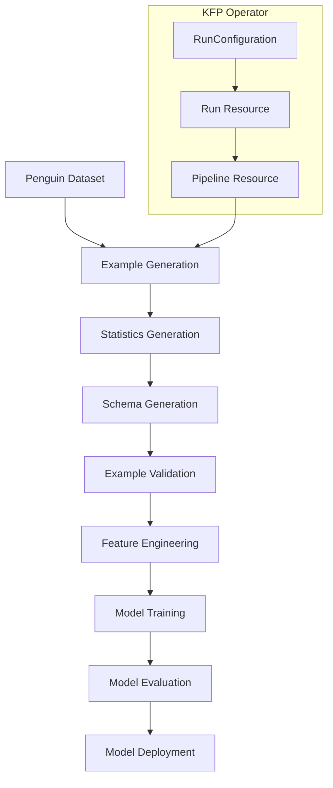

# ML Pipeline Training Tutorial

This comprehensive tutorial walks you through creating, deploying, and managing a complete TFX training pipeline using the KFP Operator. You'll learn how to build a penguin species classification pipeline and manage its entire lifecycle through Kubernetes Custom Resources.

## What You'll Learn

By the end of this tutorial, you'll be able to:

- ** Build TFX pipelines** optimized for the KFP Operator
- **Containerize ML workflows** with proper dependencies
- **Deploy pipelines** using Kubernetes resources
- **Execute and monitor** pipeline runs
- **Set up automated scheduling** for continuous training
- **Handle events** for model deployment automation

## Prerequisites

Before starting, ensure you have:

- **KFP Operator installed** in your cluster ([Installation Guide](../../getting-started/installation/))
- **Docker** for building container images
- **Container registry access** (Docker Hub, GCR, ECR, etc.)
- **Basic TFX knowledge** (helpful but not required)

## Example Code

All code for this tutorial is available on [GitHub](/blob///includes/master/quickstart).

```bash
# Clone the repository to follow along
git clone .git
cd kfp-operator/includes/master/quickstart
```

## Architecture Overview

Our training pipeline follows this architecture:



## Step 1: Build the TFX Pipeline

We'll create a complete TFX pipeline for penguin species classification, based on the [TFX penguin example](https://www.tensorflow.org/tfx/tutorials/tfx/penguin_simple).

### Understanding the Pipeline Structure

Our pipeline consists of these TFX components:

1. **ExampleGen**: Ingests raw data from CSV files
2. **StatisticsGen**: Generates statistics for data analysis
3. **SchemaGen**: Infers data schema automatically
4. **ExampleValidator**: Validates data against schema
5. **Transform**: Performs feature engineering
6. **Trainer**: Trains the ML model
7. **Evaluator**: Evaluates model performance
8. **Pusher**: Deploys the trained model

### Create the Pipeline Definition

Create `penguin_pipeline/pipeline.py`:

{}

**Key Features of This Pipeline:**

- **🎯 Simplified Interface**: No DAG runner or metadata configuration needed
- **🔧 Parameterized**: Uses environment variables for flexibility
- **📦 Containerized**: Designed to run in Kubernetes environments
- **🔄 Cacheable**: Enables component caching for faster iterations

### Create the Training Module

Create `penguin_pipeline/trainer.py`:

{}

**Training Features:**

- **🧠 Neural Network**: Simple but effective architecture
- **📊 Metrics**: Comprehensive evaluation metrics
- **💾 Model Export**: TensorFlow SavedModel format
- **🔧 Hyperparameters**: Configurable training parameters

### Create the Container Image

Create `Dockerfile`:

{}

**Container Features:**

- **Python 3.9**: Compatible with TFX requirements
- **TFX Dependencies**: All necessary libraries included
- **Security**: Non-root user for security
- **Optimized**: Multi-stage build for smaller images

### Build and Push the Container

Build the pipeline container and push to your registry:

```bash
# Set your container registry
export REGISTRY="your-registry.com/your-project"

# Build the container
docker build -t ${REGISTRY}/penguin-pipeline:v1.0.0 .

# Push to registry
docker push ${REGISTRY}/penguin-pipeline:v1.0.0
```

**Alternative: Using Cloud Build (GCP)**

```bash
# Build using Google Cloud Build
gcloud builds submit --tag gcr.io/your-project/penguin-pipeline:v1.0.0 .
```

**Alternative: Using GitHub Actions**

```yaml
# .github/workflows/build-pipeline.yml
name: Build Pipeline
on:
  push:
    branches: [main]
jobs:
  build:
    runs-on: ubuntu-latest
    steps:
      - uses: actions/checkout@v3
      - name: Build and push
        uses: docker/build-push-action@v3
        with:
          push: true
          tags: ${{ secrets.REGISTRY }}/penguin-pipeline:${{ github.sha }}
```

### Verify the Build

Test your container locally:

```bash
# Run container to verify it works
docker run --rm ${REGISTRY}/penguin-pipeline:v1.0.0 python -c "
import tfx
from penguin_pipeline.pipeline import create_pipeline
print('Pipeline build successful!')
print(f'TFX version: {tfx.__version__}')
"
```

Expected output:
```
Pipeline build successful!
TFX version: 1.14.0
```

## 2. Create a Pipeline Resource

Now that we have a pipeline image, we can create a `pipeline.yaml` resource to manage the lifecycle of this pipeline on Kubeflow:

{}

```bash
kubectl apply -f resources/pipeline.yaml
```

The pipeline now gets uploaded to Kubeflow in several steps. After a few seconds to minutes, the following command should result in a success:

```bash
kubectl get pipeline

NAME               SYNCHRONIZATIONSTATE   PROVIDERID
penguin-pipeline   Succeeded              53905abe-0337-48de-875d-67b9285f3cf7
```

Now visit your Kubeflow Pipelines UI. You should be able to see the newly created pipeline named `penguin-pipeline`. 
Note that you will see two versions: 'penguin-pipeline' and 'v1'. This is due to an [open issue on Kubeflow](https://github.com/kubeflow/pipelines/issues/5881) where you can't specify a version when creating a pipeline.

## 3. Create an Experiment resource

Note: this step is optional. You can continue with the next step if you want to use the `Default` experiment instead.

Create `experiment.yaml`:

{}

```bash
kubectl apply -f resources/experiment.yaml
```

## 4. Create a pipeline RunConfiguration resource

We can now define a recurring run declaratively using the `RunConfiguration` resource.

Note: remove `experimentName` if you want to use the `Default` experiment instead of `penguin-experiment`

Create `runconfiguration.yaml`:

{}

```bash
kubectl apply -f resources/runconfiguration.yaml
```

This will trigger run of `penguin-pipeline` once every hour. Note that the cron schedule uses a 6-place space separated syntax as defined [here](https://pkg.go.dev/github.com/robfig/cron#hdr-CRON_Expression_Format).

## 5. (Optional) Deploy newly trained models

If the operator has been installed with [Argo-Events](https://argoproj.github.io/argo-events/) support, we can now specify eventsources and sensors to update arbitrary Kubernetes config when a pipeline has been trained successfully.
In this example we are updating a serving component with the location of the newly trained model. 

Create `apply-model-location.yaml`. This creates an `EventSource` and a `Sensor` as well as an `EventBus`:

{}

```bash
kubectl apply -f resources/apply-model-location.yaml
```
