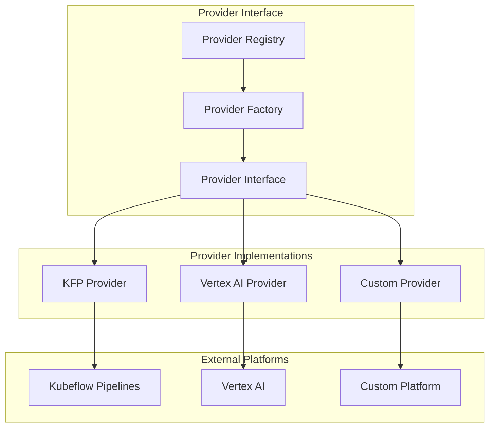
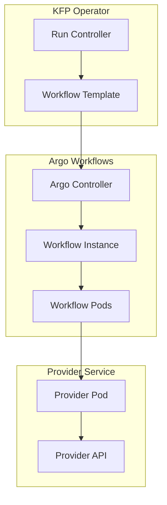
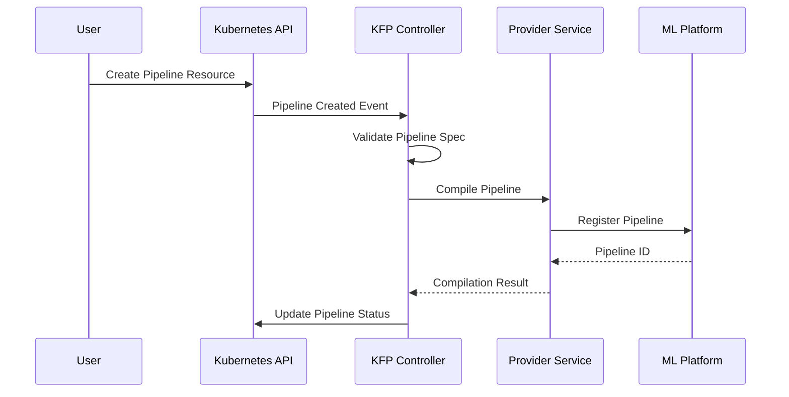
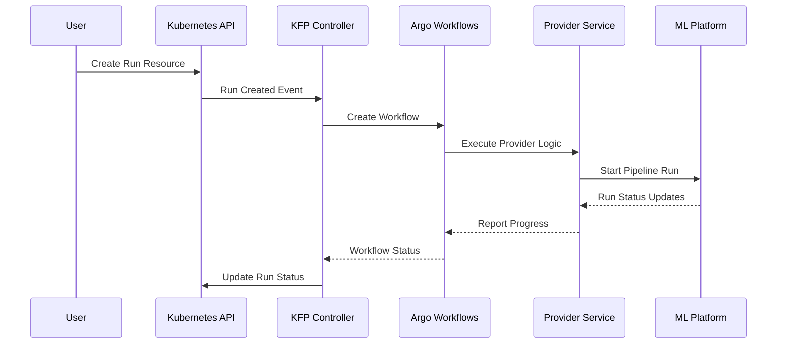
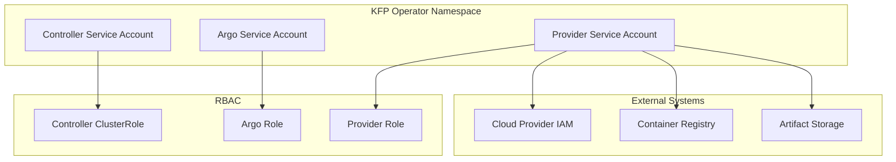
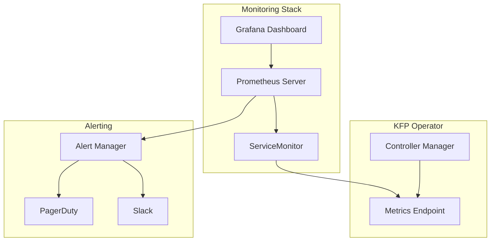

# KFP Operator Architecture

This section provides a comprehensive deep dive into the KFP Operator architecture, designed for platform engineers who need to understand the system internals for installation, configuration, maintenance, and troubleshooting.

## System Overview

The KFP Operator follows the standard Kubernetes operator pattern, extending the Kubernetes API with domain-specific knowledge for ML pipeline management. The architecture is designed for scalability, reliability, and extensibility.

## Core Components

### 1. Controller Manager

The heart of the KFP Operator, responsible for:

#### Reconciliation Logic
- **Custom Resource Lifecycle**: Manages Pipeline, Run, RunConfiguration, and Provider resources
- **State Synchronization**: Ensures desired state matches actual state
- **Event Processing**: Handles Kubernetes events and custom events
- **Error Handling**: Implements retry logic and error recovery

### 2. Provider System

#### Provider Abstraction
The provider system abstracts different ML orchestration platforms:



#### Provider Capabilities
- **Pipeline Management**: Create, update, delete pipelines
- **Run Execution**: Start, monitor, stop pipeline runs
- **Artifact Management**: Handle input/output artifacts
- **Event Publishing**: Publish run completion events

### 3. Workflow Execution Engine

#### Argo Workflows Integration
The operator uses Argo Workflows for reliable execution:



#### Workflow Lifecycle
1. **Template Generation**: Controller creates Argo Workflow template
2. **Workflow Submission**: Template is submitted to Argo
3. **Pod Scheduling**: Argo schedules workflow pods
4. **Provider Execution**: Pods execute provider-specific logic
5. **Status Reporting**: Results are reported back to controller

## Data Flow and Interactions

### Pipeline Deployment Flow



### Run Execution Flow



## Security Architecture

### Authentication and Authorization

#### Service Account Strategy


#### Permission Model
- **Cluster-Level**: CRD management, cluster-wide resource access
- **Namespace-Level**: Resource creation and management within namespaces
- **External Systems**: Cloud provider authentication and authorization

### Network Security

#### Network Policies
```yaml
# Restrict operator network access
apiVersion: networking.k8s.io/v1
kind: NetworkPolicy
metadata:
  name: kfp-operator-network-policy
spec:
  podSelector:
    matchLabels:
      app.kubernetes.io/name: kfp-operator
  policyTypes:
  - Ingress
  - Egress
  ingress:
  - from:
    - namespaceSelector:
        matchLabels:
          name: kfp-operator-system
  egress:
  - to:
    - namespaceSelector:
        matchLabels:
          name: kubeflow
    ports:
    - protocol: TCP
      port: 8888
```

## Observability Architecture

### Metrics Collection

#### Prometheus Integration


#### Key Metrics
- **Controller Metrics**: Reconciliation rate, error rate, queue depth
- **Resource Metrics**: Pipeline count, run success rate, execution time
- **Provider Metrics**: API latency, error rate, availability
- **System Metrics**: CPU, memory, network usage

### Logging Architecture

#### Structured Logging
```json
{
  "timestamp": "2024-01-15T10:30:00Z",
  "level": "INFO",
  "logger": "pipeline-controller",
  "message": "Pipeline reconciliation completed",
  "pipeline": "training-pipeline",
  "namespace": "ml-team",
  "reconciliation_id": "abc-123-def",
  "duration_ms": 150
}
```

#### Log Aggregation
- **Collection**: Fluent Bit or Fluentd agents
- **Processing**: Log parsing and enrichment
- **Storage**: Elasticsearch, Loki, or cloud logging
- **Analysis**: Kibana, Grafana, or cloud dashboards

## Architecture Troubleshooting

### Component Health Checks

#### Controller Health
```bash
# Check controller status
kubectl get pods -n kfp-operator-system
kubectl logs -n kfp-operator-system deployment/kfp-operator-controller-manager
```

#### Provider Health
```bash
# Check provider connectivity
kubectl get providers
kubectl describe provider <provider-name>

# Test provider endpoints (requires port-forwarding)
kubectl exec -it deployment/kfp-operator-controller-manager -- \
  curl -f http://provider-endpoint/health
```

### Performance Debugging

#### Resource Usage
```bash
# Check resource consumption
kubectl top pods -n kfp-operator-system

# Monitor controller metrics
kubectl port-forward -n kfp-operator-system svc/kfp-operator-metrics 8080:8080
curl http://localhost:8080/metrics | grep controller
```

---

**Need more details?** Explore the [System Overview](system-overview/) for detailed component documentation, or check the [Configuration Guide](../configuration/) for customization options.
