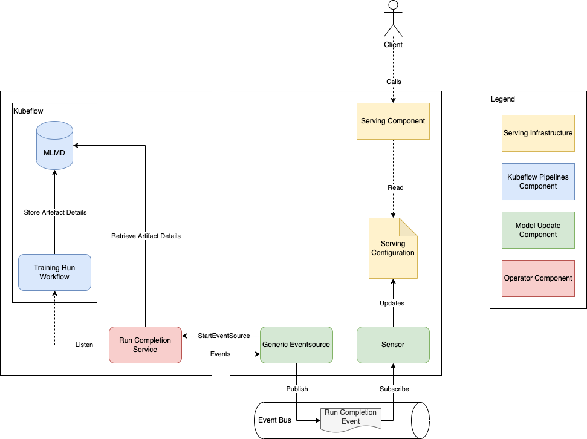

# Run Completion Eventsource

The Run Completion Eventsource allows reacting to finished pipeline runs.



The specification of the eventsource follows those of other [generic Argo-Events eventsources](https://argoproj.github.io/argo-events/eventsources/generic/):

```yaml
apiVersion: argoproj.io/v1alpha1
kind: EventSource
metadata:
  name: model-update-eventsource
spec:
  generic:
    model-update:
      insecure: true
      url: "kfp-operator-model-update-eventsource-server.kfp-operator-system.svc:50051"
      config: |-
        kfpNamespace: kubeflow-pipelines
```

The configuration currently has a single field `kfpNamespace` which defines what namespace to watch pipeline workflows in.

The events have the following format:

```json
{
  "status": "succeeded|failed",
  "pipelineName":"{{ PIPELINE_NAME }}",
  "servingModelArtifacts": [
    {
      "name":"{{ PIPELINE_NAME }}:{{ WORKFLOW_NAME }}:Pusher:pushed_model:{{ PUSHER_INDEX }}",
      "location":"gs://{{ PIPELINE_ROOT }}/Pusher/pushed_model/{{ MODEL_VERSION }}"
    }
  ]
}
```

Note that Argo-Events emits the body of these messages as base64 encoded Json string. 
A sensor for the pipeline `penguin-pipeline` could look as follows:

```yaml
apiVersion: argoproj.io/v1alpha1
kind: Sensor
metadata:
  name: penguin-pipeline-model-update-sensor
spec:
  dependencies:
    - name: run-completion-eventsource
      eventSourceName: model-update-eventsource
      eventName: run-completion
      filters:
        data:
          - path: body
            template: '{{ ((b64dec .Input) | mustFromJson).status }}'
            type: string
            comparator: "="
            value:
              - "succeeded"
          - path: body
            template: '{{ ((b64dec .Input) | mustFromJson).pipelineName }}'
            type: string
            comparator: "="
            value:
              - "penguin-pipeline"
  triggers:
    - template:
        log: {}
```

For more information and an in-depth example, see the [Quickstart Guide](./quickstart/README.md#deploy-newly-trained-models) and [Argo-Events Documentation](https://argoproj.github.io/argo-events/).

Please make sure to provide an event bus for the eventsource and the sensor to connect to.
You can define a default event bus, which does not require further configuration on either end, as follows:

```yaml
apiVersion: argoproj.io/v1alpha1
kind: EventBus
metadata:
  name: default
spec:
  nats:
    native: {}
```
